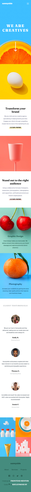
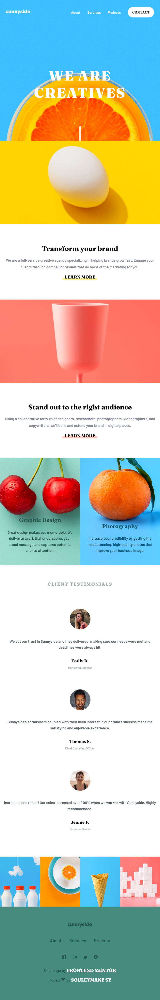
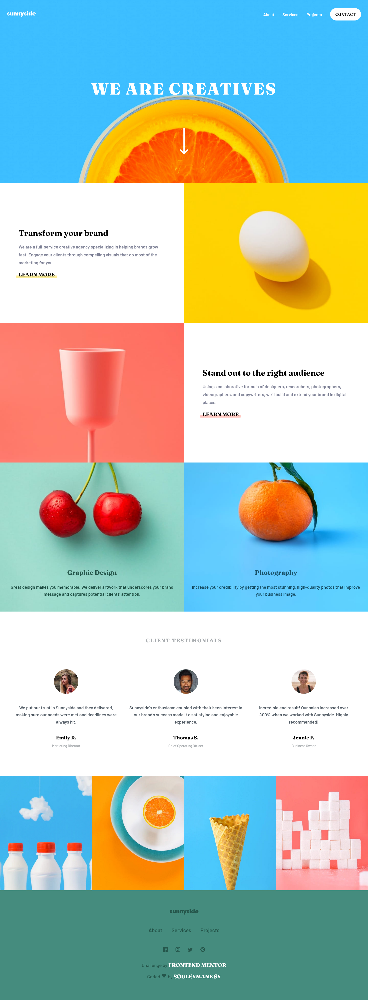

# Welcome! 👋

## Frontend Mentor - Sunnyside agency landing page solution

This is a solution to the [Sunnyside agency landing page challenge on Frontend Mentor](https://www.frontendmentor.io/challenges/sunnyside-agency-landing-page-7yVs3B6ef). Frontend Mentor challenges help you improve your coding skills by building realistic projects.

## Table of contents

- [Overview](#overview)
  - [The challenge](#the-challenge)
  - [Screenshot](#screenshot)
- [My process](#my-process)
  - [Built with](#built-with)
  - [What I learned](#what-i-learned)
  - [Continued development](#continued-development)
- [Author](#author)
- [Acknowledgments](#acknowledgments)

## Overview

### The challenge

Users should be able to:

- View the optimal layout for the site depending on their device's screen size
- See hover states for all interactive elements on the page

### Screenshot

This is the Screenshot of the projects a made!

### Mobile (375px)

### Mobile Menu Toggle

### Mobile Menu Toggle Full View

### Tablets (810px)

### Desktops (1024px)

### Links

- Solution URL: 
- Live Site URL: [Sunny-Side Agency Landing page ](https://sunny-side-agency-landing-page-main.vercel.app/)

## My process

Made this projects with HTML5 and SASS for the project structure and some Javascript for the toggle menu !!!

### Built with

- Semantic HTML5 markup
- SASS
- CSS custom properties
- Flexbox
- CSS Grid
- Mobile-first workflow
- Gulp
- npm

### What I learned

Learned to work with SASS folder structure and Gulp for the project management.

### Continued development

Want to be good with SASS And Going for Vue Js!

## Author

- GitHub - [Souleymane Sy](https://github.com/SouleymaneSy7)
- Frontend Mentor - [@SouleymaneSy7](https://www.frontendmentor.io/profile/SouleymaneSy7)
- Twitter - [@Souleymanesy43](https://twitter.com/Souleymanesy43)

## Acknowledgments

I used the tutorials video from [Coder Coder](https://www.youtube.com/@TheCoderCoder/)  on Youtube for the Gulp File configuration And the Structure for SASS!
